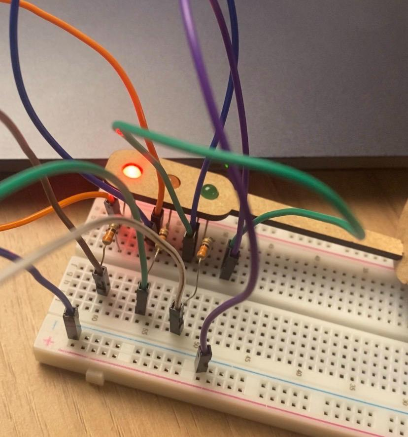

A imagem abaixo mostra que durante a montagem do circuito, usei o Arduino Uno conectado a três LEDs (vermelho, amarelo e verde), cada um com seu resistor, seguindo a proposta. Durante o processo, precisei trocar alguns componentes que estavam com defeito, como resistores e jumpers, para garantir o bom funcionamento do circuito. Após os ajustes, o sistema funcionou corretamente, com os LEDs acendendo conforme o código.

---

Avaliador: guilherme schimit

### Tabela de Avaliação entre Pares
#### Avaliador: Guilherme Schmidt
|Critério|  Contempla (Pontos)| Contempla Parcialmente (Pontos) |Não Contempla (Pontos) |Observações do Avaliador|
|-|-|-|-|-|
|Montagem física com cores corretas, boa disposição dos fios e uso adequado de resistores   |3  |   || |
|Temporização adequada conforme tempos medidos com auxílio de algum instrumento externo |3  |   | | |
|Código implementa corretamente as fases do semáforo e estrutura do código (variáveis representativas e comentários) |  3|   |   | |
|Ir além: Implementou um componente de extra, fez com millis() ao invés do delay() e/ou usou ponteiros no código |   |  0,5 |   | |
| | | | |Pontuação Total: 9,5|

Avaliador: João de caprio

### Tabela de Avaliação entre Pares
#### Avaliador: Guilherme Schmidt
|Critério|  Contempla (Pontos)| Contempla Parcialmente (Pontos) |Não Contempla (Pontos) |Observações do Avaliador|
|-|-|-|-|-|
|Montagem física com cores corretas, boa disposição dos fios e uso adequado de resistores   |3  |   || |
|Temporização adequada conforme tempos medidos com auxílio de algum instrumento externo |3  |   | | |
|Código implementa corretamente as fases do semáforo e estrutura do código (variáveis representativas e comentários) |  3|   |   | |
|Ir além: Implementou um componente de extra, fez com millis() ao invés do delay() e/ou usou ponteiros no código |   |  0,5 |   | |
| | | | |Pontuação Total: 9,5|
